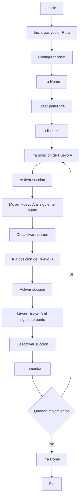

# Robótica Industrial - Análisis y Operación del Manipulador EPSON T3-401S

**Universidad Nacional de Colombia**  
Facultad de Ingeniería – Sede Bogotá

**Estudiantes:**
  - Edward Jeisen Jair Arévalo Peña
  - Juan Diego López Mayorga

**Profesores:**
  - Pedro Fabian Cardenas Herrera
  - Manuel Felipe Carranza Montenegro
---

## Introducción

La robótica industrial se ha consolidado como una de las tecnologías más importantes dentro de los procesos de automatización moderna, permitiendo incrementar la productividad, la precisión y la seguridad en diferentes sectores industriales. Los manipuladores robóticos son capaces de ejecutar tareas repetitivas y complejas mediante movimientos controlados y programados, lo que los convierte en herramientas fundamentales para aplicaciones de ensamblaje, manipulación de materiales, inspección y manufactura. Debido a la gran variedad de configuraciones y prestaciones existentes, resulta necesario comprender las características técnicas y operativas de cada tipo de robot para seleccionar la alternativa más adecuada según los requerimientos de una aplicación específica.

En el presente laboratorio se estudió el manipulador industrial EPSON T3-401S, abordando sus configuraciones iniciales, modos de operación manual y herramientas de programación mediante el software EPSON RC+ 7.0. Asimismo, se realizó una comparación de sus características con otros manipuladores industriales, se analizaron las trayectorias disponibles para su movimiento y se desarrolló una aplicación de manipulación. Debido a inconvenientes técnicos, no fue posible llevar a cabo la implementación física de la trayectoria programada. Por esto, el desarrollo del laboratorio se enfocó en la simulación y validación virtual de las rutinas propuestas.

---
## Especificaciones técnicas

A través de un cuadro comparativo de las especificaciones técnicas de cada robot empleado hasta la fecha en el curso de Robótica, se propone identificar similitudes y diferencias en sus parámetros.   

| Especificación | Motoman MH6 | ABB IRB 140 | EPSON T3-401S |
|----------------|------------:|------------:|--------------:|
|Fabricante |  Yaskawa  |  ABB  |  Epson |
| Tipo de robot | Articulado | Articulado | SCARA |
| Grados de libertad | 6 | 6 | 4 |
| Carga útil máxima| 6 kg | 6 kg | 3 kg |
| Alcance máximo | 1422 mm | 810 mm | 400 mm |
| Repetibilidad | ±0.08 mm | ±0.03 mm | ±0.02 mm |
| Peso del robot | 130 kg | 98 kg | 16 kg |
|Vel. máxima | 200°/s | 200°/s | 3700mm/s  2.600°/s|
|Montaje en lab. | Raíl (eje lineal) | Suelo | Cabina|
| Controlador | DX100 | IRC5 | RC700 |
|Consumo de potencia | 1.5 kVA | 0.44 kW | 0.66 kVA|
|Nivel de protección | No especificado | IP67 | IP20|
|Tipo de actuadores | Servomotores AC | Servomotores AC |Servomotores AC |
| Lenguaje de programación | Python | RAPID | SPEL+ |
|Software compatible | RoboDK | RobotStudio | EPSON RC+ 7.0|
|Aplicaciones | Soldadura | Ensamblaje | Pick-and-place

---
## Posición de HOME

La configuración HOME corresponde a la posición de referencia utilizada por el manipulador para establecer un punto seguro de operación. A diferencia de otros robots industriales donde la posición de referencia suele expresarse directamente en grados o unidades lineales, en el EPSON T3-401S la configuración HOME se almacena mediante los pulsos del codificador (encoder pulses) asociados a cada articulación. Estos pulsos representan la posición absoluta de los ejes y permiten al controlador determinar con precisión la ubicación de cada articulación durante el proceso de homing.

Para "Junior", que es el robot utilizado en el laboratorio, la configuración mostrada correspondía a J1 = 204800 pulsos, mientras que J2, J3 y J4 se encontraban en 0 pulsos. Adicionalmente, el procedimiento de retorno a HOME se ejecuta siguiendo un orden específico de movimiento de las articulaciones, priorizando el eje vertical (J3) para garantizar que el manipulador alcance la posición de referencia de manera segura y así evitar posibles colisiones.

**IMAGEN 1

Desde el punto de vista geométrico, la posición HOME del EPSON T3-401S ubica los dos eslabones principales del brazo SCARA alineados entre sí, formando una configuración recta respecto al eje de la base. Asimismo, el eje vertical (J3) se posiciona en su punto superior de recorrido, manteniendo la herramienta alejada de la superficie de trabajo. Esta configuración proporciona una posición fácilmente identificable, minimiza el riesgo de interferencias con objetos del entorno y constituye el punto de partida para la ejecución de trayectorias y tareas programadas.

***IMAGEN 2

---
## Movimiento en EPSON RC+ 7.0

Para realizar movimientos manuales del manipulador EPSON T3-401S mediante el software EPSON RC+, primero es necesario acceder al menú \textbf{Herramientas} ubicado en la barra superior del programa. Posteriormente, se selecciona la opción Administrador del robot y, dentro de esta ventana, se ingresa al apartado Mover y enseñar, el cual proporciona las herramientas necesarias para controlar manualmente la posición y orientación del robot.

Una vez dentro de la interfaz de movimiento manual, el usuario puede seleccionar el modo de operación mediante la lista desplegable Modo. Cuando se requiere desplazar el robot utilizando coordenadas cartesianas, debe seleccionarse el modo Mundo, el cual permite realizar movimientos respecto al sistema de coordenadas global. Por otro lado, si se desea controlar directamente cada articulación del manipulador, debe seleccionarse el modo Articulación, permitiendo actuar individualmente sobre los ejes del robot.

**IMAGEN 3

En el modo Mundo, los desplazamientos se realizan mediante los botones de dirección mostrados en pantalla. Los movimientos de traslación se efectúan sobre los ejes cartesianos X, Y y Z utilizando los controles +X, -X, +Y -Y, +Z y -Z. De esta manera, el efector final puede desplazarse dentro del espacio de trabajo sin necesidad de controlar cada articulación por separado.

En el modo Articulación, la orientación de los eslabones se puede modificar mediante los controles de rotación asociados a los ejes J1, J2 y J4 (J3 es lineal). Los botones +J1 y -J1, +J2 y -J2, así como +J4 y -J4, permiten realizar rotaciones positivas y negativas alrededor de cada eje de orientación, respectivamente. A su vez, con +J3 y -J3 se controla la posición lineal del eje vertical.

**IMAGEN 4

Finalmente, el software muestra en tiempo real la posición actual del robot, indicando las coordenadas X, Y y Z en milímetros, así como los ángulos de orientación correspondientes. Esta información permite verificar los movimientos ejecutados y facilita la enseñanza de puntos para la posterior programación de trayectorias.

---
## Velocidad en EPSON RC+ 7.0

Los movimientos manuales del EPSON T3-401S pueden ejecutarse a diferentes velocidades, las cuales se seleccionan mediante la lista desplegable Velocidad disponible en la ventana Mover y enseñar. El software solo permite velocidad Baja o Alta, lo que nos permite elegir entre movimientos más precisos o desplazamientos más rápidos según la tarea a realizar.

La velocidad seleccionada afecta directamente la rapidez con la que se ejecutan los movimientos manuales, independientemente de si el robot se encuentra en modo \textbf{Mundo} (cartesiano) o \textbf{Articulación}. El nivel establecido puede identificarse fácilmente observando la opción activa en la lista desplegable de velocidad, al lado de la lista desplegable Modo.

---
## Funcionalidades en EPSON RC+ 7.0

EPSON RC+ 7.0 es el entorno de programación y simulación desarrollado por Epson para la configuración y operación de este modelo de robot SCARA. Entre sus principales funcionalidades se encuentran la creación y edición de rutinas, la enseñanza de puntos, la definición de herramientas y sistemas de coordenadas, la configuración de entradas y salidas digitales, importación de piezas y la simulación de trayectorias antes de su ejecución en el manipulador físico.

Por dificultades de disponibilidad, el robot dispuesto en el laboratorio no contaba con un teach pendant dedicado. En su lugar, el EPSON T3-401S del laboratorio fue controlado directamente desde un computador conectado al controlador del robot mediante EPSON RC+ 7.0. En este caso, el software desempeña las funciones de un teach pendant virtual, ya que permite mover manualmente el robot, enseñar posiciones, modificar parámetros de operación y monitorear continuamente las variables del sistema desde la interfaz gráfica.

Para ejecutar movimientos, EPSON RC+ 7.0 interpreta el programa desarrollado por el usuario y lo convierte en comandos que son enviados al controlador. Este calcula las trayectorias necesarias y coordina el movimiento de cada articulación para alcanzar las posiciones objetivo respetando los parámetros de posición deseada, velocidad y otros parámetros. De esta forma, el sistema garantiza que los desplazamientos se realicen de manera precisa, controlada y segura dentro del espacio de trabajo del robot.

Para la aplicación de manipulación y ubicación de huevos en la cubeta, resultó especialmente útil la función Jump Pallet incorporada en EPSON RC+ 7.0. Esta instrucción automatiza el desplazamiento seguro entre posiciones. Su funcionamiento consiste en elevar inicialmente el eje vertical J3 hasta una altura segura, realizar posteriormente el desplazamiento horizontal en el plano XY mediante los ejes J1 y J2, y finalmente descender nuevamente el eje J3 hasta la posición objetivo para efectuar la toma o liberación del huevo.

---
## Análisis comparativo

| Característica               | RobotStudio                                                                                       | RoboDK                                                                                                 | EPSON RC+ 7.0                                                                                                               |
| ---------------------------- | ------------------------------------------------------------------------------------------------- | ------------------------------------------------------------------------------------------------------ | --------------------------------------------------------------------------------------------------------------------------- |
| **Compatibilidad**           | Alta integración con robots ABB y sus controladores reales.                                       | Amplia compatibilidad con diferentes marcas y modelos de robots industriales.                          | Diseñado específicamente para robots Epson y sus controladores.                                                             |
| **Precisión de simulación**  | Simulación muy precisa gracias a la integración con RobotWare y la emulación del controlador ABB. | Simulaciones funcionales y eficientes, aunque con menor nivel de detalle respecto al controlador real. | Alta precisión para robots Epson, permitiendo trabajar con robots virtuales y reales.                                       |
| **Facilidad de uso**         | Herramientas avanzadas, pero puede resultar más complejo para usuarios principiantes.             | Interfaz intuitiva y sencilla para programación y simulación rápida.                                   | Herramientas intuitivas para enseñanza y control manual, aunque la navegación de la interfaz puede resultar menos amigable. |
| **Programación**             | Utiliza principalmente el lenguaje RAPID para robots ABB.                                         | Permite generar programas mediante Teach Programming o Python.                                         | Emplea el lenguaje SPEL+, desarrollado específicamente para robots Epson.                                                   |
| **Aplicaciones principales** | Diseño, simulación y puesta en marcha de celdas robotizadas ABB.                                  | Simulación, programación offline y validación de trayectorias para múltiples fabricantes.              | Programación, control, configuración y operación de robots Epson en aplicaciones adaptadas.                                 |
| **Ventajas**                 | Alta fidelidad en la simulación y comunicación directa con controladores ABB.                     | Flexibilidad, facilidad de uso y compatibilidad con diferentes fabricantes.                            | Comunicación directa con el controlador y control del robot físico desde el computador.                                     |
| **Limitaciones**             | Compatibilidad limitada principalmente a robots ABB y mayor complejidad de aprendizaje.           | Menor nivel de emulación detallada del controlador frente a herramientas especializadas.               | Compatibilidad limitada a robots Epson y menor flexibilidad para trabajar con robots de otros fabricantes.                  |
|                              |                                                                                                   |                                                                                                        |                                                                                                                             |

A partir de la experiencia desarrollada en el laboratorio, se identificó que RobotStudio es la herramienta más adecuada cuando se trabaja exclusivamente con robots ABB. Su principal ventaja es la alta fidelidad de simulación, ya que utiliza tecnologías derivadas del controlador real, permitiendo validar programas y trayectorias con gran precisión antes de implementarlas físicamente. Sin embargo, esta especialización constituye también su principal limitación, puesto que su uso se restringe prácticamente a robots ABB y requiere un mayor tiempo de aprendizaje. Sus aplicaciones más comunes se encuentran en el diseño, simulación y programación de robots ABB.

Por otra parte, RoboDK destacó por su facilidad de uso y su compatibilidad con una gran variedad de fabricantes, lo que lo convierte en una herramienta versátil para programación, simulación y validación de trayectorias. Emplear Python como lenguaje de programación facilita encontrar material útil en la web o la literatura. También es importante mencionar que una de sus ventajas principales es la flexibilidad para adaptarse a diferentes plataformas robóticas, pues tiene una librería de robots y componentes más extensa. Sin embargo presenta una interfaz menos pulida que no luce tan profesional como RobotStudio o EPSON RC+ 7.0, presentada a continuación.

Finalmente, EPSON RC+ 7.0 sobresale por su integración directa con los robots Epson, ya que permite programar, simular, configurar y controlar el manipulador desde una única interfaz. Durante la práctica, el software actuó como un teach pendant virtual, facilitando el movimiento manual, la enseñanza de puntos y la ejecución de trayectorias en el EPSON T3-401S. No obstante, su principal limitación es que está diseñado específicamente para robots Epson, lo que reduce su aplicabilidad en entornos con robots de diferentes fabricantes. Sus aplicaciones se centran en la programación, supervisión y operación de sistemas robóticos Epson tanto en entornos educativos como industriales. Adicionalmente, al igual que con RoboDK, no se cuenta con un software tan pulido, especialmente hablando de las diferentes pantallas o pestañas que se superponen una a la otra.

---
## Diagrama de flujo

