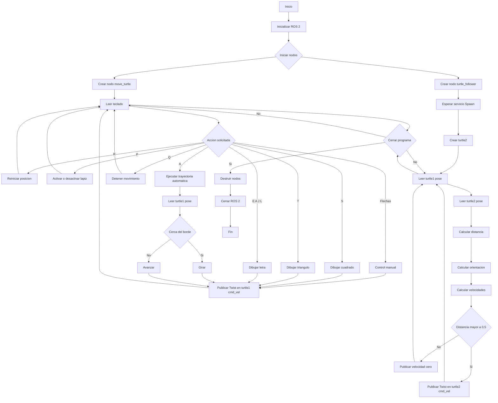

# Robótica de Desarrollo, Intro a ROS 2 Jazzy Jalisco - Turtlesim

**Universidad Nacional de Colombia**  
Facultad de Ingeniería – Sede Bogotá

**Estudiantes:**
  - Edward Jeisen Jair Arévalo Peña
  - Juan Diego López Mayorga

**Profesores:**
  - Pedro Fabian Cardenas Herrera
  - Manuel Felipe Carranza Montenegro

28 de Junio del 2026

# Índice

- [Descripción general](#descripción-general-del-laboratorio)
- [Control manual](#explicación-del-control-manual-de-la-tortuga)
- [Funciones automáticas](#explicación-de-las-funciones-automáticas-implementadas)
- [Letras personalizadas](#explicación-del-dibujo-de-letras-personalizadas)
- [Sistema líder-seguidor](#explicación-del-sistema-líder-seguidor-con-dos-tortugas)
- [Nodos, tópicos y servicios](#descripción-de-los-nodos-tópicos-y-servicios-utilizados)
- [Evidencias de ejecución del programa](#evidencias-de-ejecución-del-programa)
- [Diagrama de flujo del sistema](#diagrama-de-flujo-del-sistema)
- [Evidencias de funcionamiento](#evidencia-de-funcionamiento)
- [Anexos](#anexos)

---

## Descripción general del laboratorio

El presente laboratorio tuvo como objetivo desarrollar una aplicación de control para el simulador **Turtlesim** utilizando **ROS 2 Jazzy Jalisco** y el lenguaje de programación **Python** mediante la biblioteca **rclpy**. Durante el desarrollo se implementaron dos nodos principales: `move_turtle.py`, encargado del control y la interacción con la tortuga principal, y `turtle_follower.py`, responsable de crear una segunda tortuga y realizar un seguimiento automático de la primera.

El nodo **move_turtle.py** implementa un controlador interactivo basado en teclado que permite desplazar la tortuga mediante las flechas de dirección, publicando comandos de velocidad sobre el tópico `/turtle1/cmd_vel`. Además del control manual, incorpora diversas funcionalidades solicitadas en el laboratorio, entre ellas el dibujo automático de figuras geométricas como un cuadrado y un triángulo, el trazado de las letras **E**, **A**, **J** y **L**, un modo de movimiento autónomo dentro de los límites del simulador, el reinicio de la posición de la tortuga mediante servicios de teletransporte y la activación o desactivación del lápiz para controlar el dibujo sobre la pantalla. Todas estas acciones se realizan haciendo uso de la comunicación mediante tópicos y servicios propios de ROS 2.

Como complemento, se desarrolló el nodo **turtle_follower.py**, cuya función consiste en crear dinámicamente una segunda tortuga mediante el servicio `Spawn` y controlar su movimiento para que siga continuamente a la tortuga principal. Para ello, el nodo se suscribe a los tópicos de posición de ambas tortugas (`/turtle1/pose` y `/turtle2/pose`), calcula en tiempo real la distancia y el ángulo entre ellas y genera comandos de velocidad proporcionales que permiten un seguimiento suave y estable, manteniendo una separación mínima para evitar que ambas tortugas se superpongan.

Finalmente, el laboratorio permitió aplicar los conceptos fundamentales de ROS 2 relacionados con la creación de nodos, publicación y suscripción a tópicos, utilización de servicios, temporizadores y programación de aplicaciones distribuidas. Asimismo, se evidenció la interacción entre múltiples nodos ejecutándose simultáneamente y comunicándose mediante la arquitectura de ROS 2 para implementar un sistema completo de control y seguimiento en un entorno de simulación.

## Explicación del control manual de la tortuga

El control manual de la tortuga fue implementado mediante el nodo `move_turtle.py`, el cual actúa como interfaz entre el usuario y el simulador **Turtlesim**. Para ello, el nodo captura continuamente las pulsaciones del teclado utilizando las bibliotecas `termios`, `tty` y `select`, permitiendo leer las teclas sin necesidad de presionar la tecla Enter y sin bloquear la ejecución del programa.

Cada una de las flechas del teclado se encuentra asociada a un par de velocidades lineales y angulares almacenadas en un diccionario denominado `key_bindings`. Cuando el usuario presiona una de estas teclas, el programa identifica la combinación correspondiente y construye un mensaje del tipo `geometry_msgs/Twist`, asignando los valores de velocidad lineal (`linear.x`) y velocidad angular (`angular.z`) necesarios para producir el movimiento deseado.

Posteriormente, el mensaje es publicado sobre el tópico `/turtle1/cmd_vel`, al cual se encuentra suscrito el nodo `turtlesim_node`. De esta manera, el simulador recibe las velocidades enviadas por el controlador y actualiza en tiempo real la posición y orientación de la tortuga dentro del entorno gráfico.

Para evitar conflictos entre el control del usuario y los movimientos automáticos, el programa emplea variables de estado que indican cuándo la tortuga se encuentra ejecutando una rutina de dibujo o un modo autónomo. Mientras una de estas tareas está activa, la lectura del teclado se restringe únicamente a los comandos de interrupción o control, garantizando que cada trayectoria se complete correctamente sin recibir órdenes contradictorias.

## Explicación de las funciones automáticas implementadas

Además del control manual de la tortuga, se implementó un conjunto de funciones automáticas que pueden ejecutarse mediante diferentes teclas del teclado. Cada una de estas acciones fue desarrollada como un método independiente dentro del nodo `move_turtle.py`, permitiendo mantener una estructura modular y facilitando la organización del código.

Las trayectorias automáticas correspondientes al dibujo de un **cuadrado** y un **triángulo equilátero** fueron implementadas mediante las funciones `draw_square()` y `draw_triangle()`, respectivamente. Ambas rutinas generan una secuencia de movimientos lineales y giros controlados utilizando la función `execute_movement()`, la cual publica mensajes de velocidad durante un tiempo determinado. En el caso del cuadrado, la tortuga recorre cuatro segmentos rectos realizando giros de 90° entre cada lado, mientras que para el triángulo se ejecutan tres desplazamientos acompañados de giros de 120°, completando así la figura solicitada.

Para cumplir con el requerimiento de reiniciar la posición de la tortuga, se implementó la función `reset_position()`, asociada a la tecla **R**. Esta función utiliza el servicio `TeleportAbsolute` de Turtlesim para trasladar instantáneamente la tortuga a una posición predefinida en el centro del escenario, restableciendo además su orientación inicial.

La activación y desactivación del lápiz de dibujo se desarrolló mediante la función `toggle_pen()`, vinculada a la tecla **P**. Esta función realiza una llamada al servicio `SetPen`, modificando el parámetro `off` para habilitar o deshabilitar el trazado de líneas durante el desplazamiento de la tortuga. De esta manera, es posible mover la tortuga sin dejar rastro cuando se requiere reposicionarla antes de ejecutar una nueva trayectoria.

El laboratorio también contempló la implementación de un **modo autónomo**, activado mediante la tecla **A**. En este modo, el nodo consulta continuamente la posición actual de la tortuga a través del tópico `/turtle1/pose`. Cuando detecta que la tortuga se aproxima a alguno de los límites de la ventana de simulación, modifica temporalmente la velocidad angular para cambiar su dirección de movimiento, evitando que salga del área de trabajo. Mientras la tortuga permanece alejada de los bordes, continúa avanzando en línea recta con una velocidad constante.

Finalmente, la tecla **Q** permite detener completamente el movimiento de la tortuga. Para ello, la función `stop_turtle()` publica un mensaje `Twist` con velocidades lineal y angular iguales a cero, cancelando cualquier desplazamiento manual o automático que se encuentre en ejecución. Esta función también desactiva el modo autónomo, garantizando que el sistema permanezca completamente detenido hasta recibir una nueva orden por parte del usuario.

# Explicación del dibujo de letras personalizadas

Como parte de los requerimientos del laboratorio, se implementó un conjunto de funciones destinadas al dibujo automático de las iniciales correspondientes a los integrantes del equipo. En este caso, las letras seleccionadas fueron **E**, **A** (Edward Arevalo), **J** y **L** (Juan Lopez), las cuales pueden ejecutarse directamente desde el teclado mediante las teclas asignadas a cada una de ellas.

Siguiendo las especificaciones del laboratorio, cada letra fue desarrollada de manera modular mediante una función independiente (`draw_E()`, `draw_A()`, `draw_J()` y `draw_L()`). Esta organización facilita la lectura, mantenimiento y ampliación del código, permitiendo modificar o incorporar nuevas letras sin afectar el funcionamiento del resto de la aplicación.

El procedimiento de dibujo consiste en ejecutar una secuencia ordenada de movimientos lineales y rotaciones previamente definidas. Para ello, todas las funciones reutilizan el método `execute_movement()`, encargado de publicar mensajes de velocidad durante un intervalo de tiempo determinado. Mediante la combinación de desplazamientos rectos, avances, retrocesos y cambios de orientación, la tortuga recorre una trayectoria que reproduce la forma de cada letra sobre la superficie de dibujo del simulador.

Durante la ejecución de cualquiera de estas rutinas, el programa activa una variable de control que impide la recepción de nuevas órdenes de dibujo hasta que la trayectoria actual finalice. Esta estrategia evita que diferentes secuencias de movimiento se ejecuten simultáneamente, garantizando que cada letra sea dibujada de forma continua y sin interrupciones.

La implementación de estas funciones permitió aplicar los mismos principios utilizados en el dibujo de figuras geométricas, demostrando que es posible construir trayectorias más complejas mediante la combinación de movimientos básicos y temporizados. 

# Explicación del sistema líder-seguidor con dos tortugas

Para implementar el sistema líder-seguidor se desarrolló un segundo nodo denominado `turtle_follower.py`, cuya función es controlar automáticamente una segunda tortuga (`turtle2`) para que siga los movimientos realizados por la tortuga principal (`turtle1`). Mientras `turtle1` continúa siendo controlada mediante el nodo `move_turtle.py`, el nuevo nodo ejecuta de forma independiente el algoritmo de seguimiento utilizando la arquitectura de comunicación de ROS 2.

Al iniciar su ejecución, el nodo crea un cliente para el servicio `Spawn` de Turtlesim y solicita la creación de una segunda tortuga en una posición inicial previamente definida dentro del escenario. Una vez disponible el servicio, se envía la solicitud correspondiente y el simulador incorpora dinámicamente a `turtle2`, permitiendo comenzar el proceso de seguimiento.

Posteriormente, el nodo crea dos suscriptores que reciben continuamente la información de posición publicada en los tópicos `/turtle1/pose` y `/turtle2/pose`. Estos mensajes contienen las coordenadas cartesianas y la orientación de cada tortuga, proporcionando la información necesaria para calcular el movimiento que debe realizar la tortuga seguidora.

En cada iteración del temporizador, ejecutado con una frecuencia de 20 Hz, el programa calcula la diferencia de posición entre ambas tortugas en los ejes (x) e (y). A partir de estas diferencias se obtiene la distancia euclidiana que las separa y el ángulo que debe adoptar `turtle2` para orientarse hacia la posición actual de `turtle1`. El error angular se normaliza al intervalo ([-\pi,\pi]), garantizando que la tortuga siempre gire siguiendo la trayectoria más corta.

Con esta información se genera un mensaje de tipo `Twist` para controlar el movimiento de `turtle2`. La velocidad lineal se establece proporcionalmente a la distancia existente entre ambas tortugas, permitiendo que el desplazamiento sea mayor cuando se encuentran alejadas y disminuya progresivamente a medida que la seguidora se aproxima a la líder. Asimismo, la velocidad angular es proporcional al error de orientación, logrando que la tortuga ajuste continuamente su dirección hacia el objetivo. Adicionalmente, se limita la velocidad lineal máxima y se establece una distancia mínima de seguimiento para evitar que ambas tortugas lleguen a superponerse.

Finalmente, el mensaje de velocidad es publicado sobre el tópico `/turtle2/cmd_vel`, provocando que la segunda tortuga modifique continuamente su trayectoria para seguir los desplazamientos de la tortuga principal. Gracias a esta arquitectura distribuida, el sistema mantiene separadas las responsabilidades de cada nodo: `move_turtle.py` gestiona el control del usuario y las trayectorias automáticas de `turtle1`, mientras que `turtle_follower.py` implementa de manera completamente autónoma el comportamiento de seguimiento utilizando únicamente la información intercambiada mediante tópicos y servicios de ROS 2.

## Descripción de los nodos, tópicos y servicios utilizados

La aplicación desarrollada se encuentra compuesta por dos nodos principales, además del nodo `turtlesim_node` proporcionado por el simulador Turtlesim. La comunicación entre estos nodos se realiza mediante la arquitectura de ROS 2, utilizando tópicos para el intercambio continuo de información y servicios para la ejecución de acciones específicas.

El nodo **`move_turtle.py`** constituye el controlador principal del sistema. Su responsabilidad es gestionar el control manual de `turtle1`, ejecutar las trayectorias automáticas, dibujar las figuras y las letras programadas, activar o desactivar el lápiz de dibujo y reiniciar la posición de la tortuga. Para ello, publica mensajes de velocidad en el tópico **`/turtle1/cmd_vel`**, se suscribe al tópico **`/turtle1/pose`** para conocer la posición actual de la tortuga y utiliza los servicios **`/turtle1/set_pen`** y **`/turtle1/teleport_absolute`** para controlar el lápiz y reposicionar la tortuga, respectivamente.

El segundo nodo desarrollado corresponde a **`turtle_follower.py`**, encargado de implementar el comportamiento líder-seguidor. Al iniciar su ejecución, este nodo solicita la creación de una segunda tortuga mediante el servicio **`/spawn`**. Posteriormente, se suscribe a los tópicos **`/turtle1/pose`** y **`/turtle2/pose`** para conocer continuamente la posición de ambas tortugas. Con esta información calcula la distancia y orientación relativas, generando comandos de velocidad que publica sobre el tópico **`/turtle2/cmd_vel`**, permitiendo que `turtle2` siga automáticamente los movimientos de `turtle1`.

Por su parte, el nodo **`turtlesim_node`** es el encargado de ejecutar la simulación gráfica y de responder a las órdenes enviadas por los nodos desarrollados. Este nodo recibe los mensajes publicados sobre los tópicos de velocidad (`/turtle1/cmd_vel` y `/turtle2/cmd_vel`), actualiza la posición de las tortugas y publica continuamente su estado mediante los tópicos `/turtle1/pose` y `/turtle2/pose`. Asimismo, ofrece los servicios utilizados durante el laboratorio, tales como la creación de nuevas tortugas, el control del lápiz y el teletransporte de las tortugas dentro del escenario.

Los principales tópicos utilizados durante el desarrollo del laboratorio fueron:

* **`/turtle1/cmd_vel`**: recibe mensajes de tipo `geometry_msgs/Twist` para controlar la velocidad lineal y angular de la tortuga principal.
* **`/turtle2/cmd_vel`**: recibe mensajes de tipo `geometry_msgs/Twist` para controlar el movimiento de la tortuga seguidora.
* **`/turtle1/pose`**: publica continuamente la posición y orientación de la tortuga principal.
* **`/turtle2/pose`**: publica continuamente la posición y orientación de la segunda tortuga.

De igual forma, los servicios empleados durante la implementación fueron:

* **`/spawn`**: crea dinámicamente una nueva tortuga dentro del simulador, utilizada para implementar el sistema líder-seguidor.
* **`/turtle1/set_pen`**: permite habilitar o deshabilitar el lápiz de dibujo, además de configurar sus características.
* **`/turtle1/teleport_absolute`**: reposiciona instantáneamente la tortuga principal en unas coordenadas y orientación determinadas.

La utilización conjunta de estos nodos, tópicos y servicios permitió construir una aplicación distribuida en la que cada nodo cumple una función específica y se comunica con los demás mediante los mecanismos propios de ROS 2. 

## Evidencias de ejecución del programa

## Diagrama de flujo del sistema

## Evidencia de funcionamiento

## Anexos

Con el fin de facilitar la revisión del laboratorio, se incluyen los archivos fuente desarrollados durante la implementación de la solución. Ambos nodos fueron programados en Python utilizando la biblioteca **rclpy**, siguiendo una estructura modular y documentada mediante comentarios que describen las funciones principales del sistema.

## Video explicativo

## Archivos

| Archivo | Descripción |
|----------|-------------|
| [src/move_turtle.py](src/move_turtle.py) | Nodo principal encargado del control manual, trayectorias automáticas, dibujo de figuras y letras, así como del uso de los servicios de Turtlesim. |
| [src/turtle_follower.py](src/turtle_follower.py) | Nodo que implementa el sistema líder-seguidor, creando una segunda tortuga y controlando su movimiento mediante la información recibida de los tópicos de posición. |